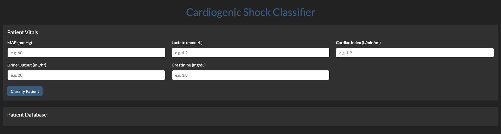
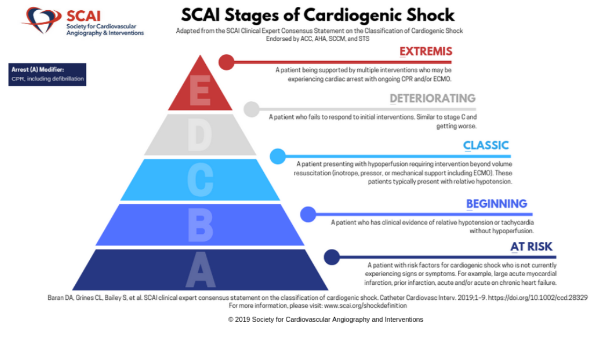
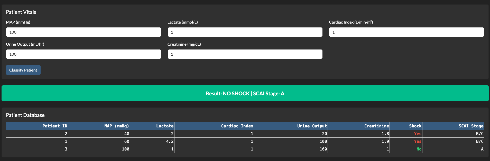
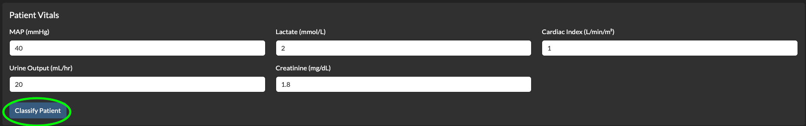
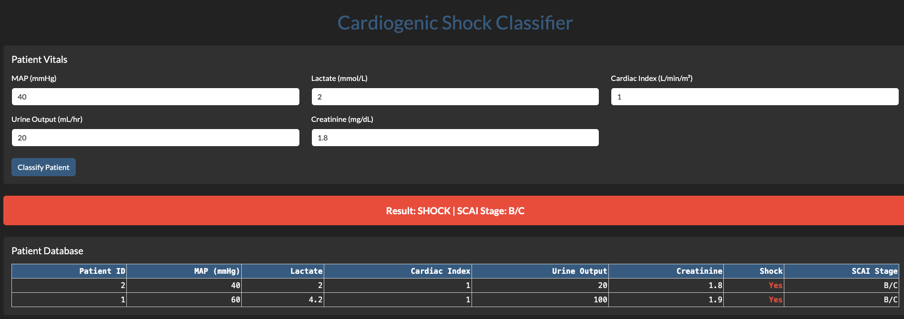

# Cardiogenic Shock Classifier Dashboard

A web-based clinical decision support tool for classifying patients into cardiogenic shock status and SCAI shock stage using real patient vitals. Built with Python, Plotly Dash, Redis, and Docker.



---

## Description

Cardiogenic shock is a life-threatening condition in which the heart is unable to pump enough blood to meet the body's demands. Early identification is critical — delays in diagnosis are associated with significantly higher mortality. The **Society for Cardiovascular Angiography and Interventions (SCAI)** has developed a standardized staging system (Stages A–E) to classify the severity of cardiogenic shock.

This dashboard allows a user to enter five key patient vitals — MAP, Lactate, Cardiac Index, Urine Output, and Creatinine — and will classify whether the patient is in cardiogenic shock and predict their SCAI Stage (A–E). Each classified patient is stored in a persistent database so records are not lost between sessions.




---

## Scripts

### `app.py`
The main Dash web application. Loads the trained SCAI classifier, connects to Redis, and serves the dashboard on port 8050. Handles patient vital input, shock classification, SCAI stage prediction, and persistent storage of all classified patients.

### `classify_shock.py`
Standalone script that implements the rule-based cardiogenic shock classification algorithm. A patient is flagged as in shock when hemodynamic compromise (MAP ≤ 60 mmHg) is present alongside at least one marker of end-organ hypoperfusion (elevated lactate, low cardiac index, low urine output, or elevated creatinine).

### `train_model.py`
Trains the SCAI stage classifier on the APACHE dataset. Loads and cleans the data, splits it into training and test sets, fits a Perceptron pipeline with standardization, evaluates accuracy, and saves the trained model to `model/scai_classifier.pkl`.

---

## Deployment

Clone the repository and run:

```bash
git clone https://github.com/prathamppatel/cardiogenic_shock_dashboard.git
cd cardiogenic_shock_dashboard
docker compose up
```

The dashboard will be accessible at `http://<your-ip>:8050`. To stop:

```bash
docker compose down
```

Patient data persists across restarts.

Alternatively, pull the pre-built image directly from Docker Hub:

```bash
docker pull prathamppatel/cardiogenic-shock-dashboard:1.0.0
```

---

## Usage

Navigate to the dashboard in your browser and enter patient vitals in the input fields, then click **Classify Patient**.



The result banner will display the shock classification and SCAI stage. The patient will be added to the database table below.


---

## Authors

Pratham Patel